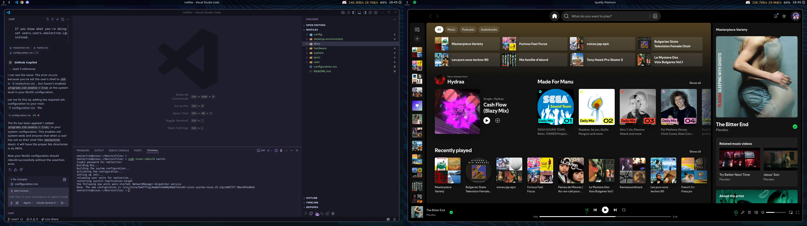

# Nixfiles

## Nixfiles is a collection of NixOS configurations to manage your system.



### Technical features

- Very clean declarative system configuration for NixOS
- Home Manager for user-land configuration and dotfiles
- Easy to configure, use, and extend
- Sane defaults for a modern and husslte free desktop experience

### Desktop features

- A modern and beatiful Wayland system with Hyprland
- No menus, no clutter, just a clean desktop, a bar, and a launcher (rofi)
- A modern and fast terminal with Kitty

### Installation

- Install NixOS on your machine
- Clone this repository to your desired location (e.g., `~/dev/nixfiles`)
- Generate your hardware configuration:
  ```bash
  sudo nixos-generate-config --dir ./hardware/
  ```
- Update the `flake.nix` file if needed (hostname, etc.)
- Test the configuration:
  ```bash
  sudo nixos-rebuild test --flake .#your-hostname
  ```
- Apply the configuration:
  ```bash
  sudo nixos-rebuild switch --flake .#your-hostname
  ```

### Customization

- `flake.nix` is the entrypoint, start reading from there, it only loads the `profiles/` directory.
- You'll notice you need to provide your own `hardware-configuration.nix` ( by running `nixos-generate-config --dir ./hardware/` )
- Then you should create a profile. A profile is a collection of system packages, user packages, services, and home configurations.
  - Profiles are defined in `profiles/`
  - You can create a new profile by copying an existing one or use the minimal template and modifying it to your needs

### Todo

- Fix audio services not remembering audio preferences by using WirePlumber
  (for the time being, right click on the audio icon in the bar and draw with Helvum)
- Fix nerd-fonts not being used correctly in Vscode etc..

- Better default for Hyprland:

  - plugin `split-monitor-workspaces`
  - Adjust too large outter gaps
  - Fix qwerty-fr using the wrong layout.
  - Set better default Keyboard shortcuts to navigate workspaces with arrows
  - Mod+Arrows change window focus, Mod+Shift+Arrows move windows, Mod+Ctrl+Arrows move windows across workspaces, Mod+Ctrl+Arrows focus workspaces

- Better default for Rofi (launcher):

  - Add a custom theme
  - Only show applications, not all binaries.
  - Allow rofi to input emojis when we seach with ":" as prefix
  - Integrate LLM as well with maybe ! bang prefix

- Support for global themes to change colors

- Add a shell such as Quickshell to have widgets on the desktop

  - Music Player widget
  - Scratchpad widget
  - Add a calendar widget

- Add vscode within home manager
  - Add vscode extensions with home manager
  - Customize fonts and themes with nix
